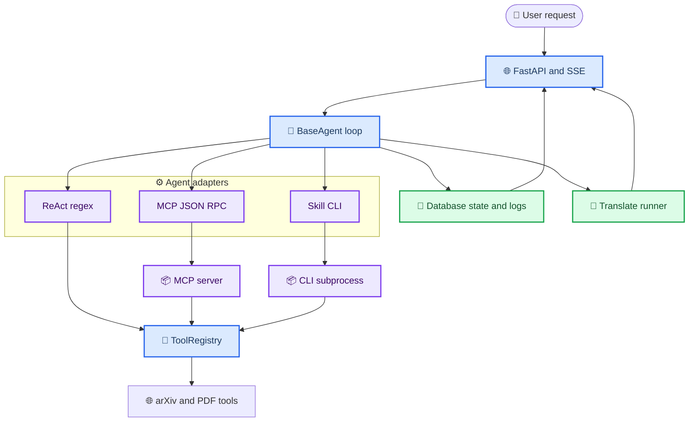
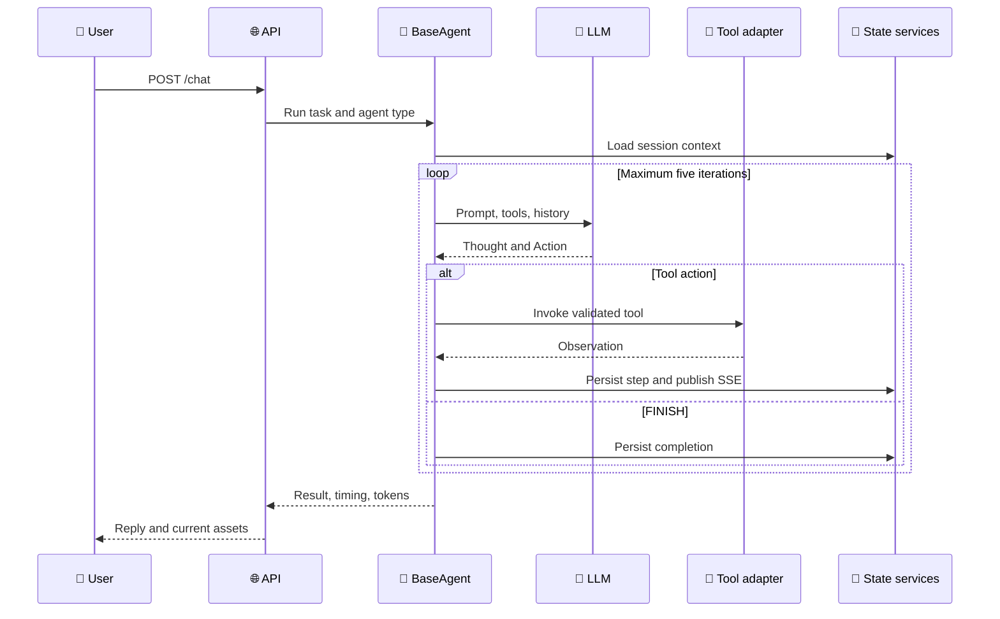

# AgenticArxiv

_面向 arXiv 论文检索、下载与中文翻译的多实现 Agent 系统_

AgenticArxiv 将同一套 ReAct 执行循环、工具协议和业务副作用复用于三种 Agent 实现：进程内 ReAct、MCP 跨进程调用与 Skill/CLI 调用。项目同时提供 Vue 3 工作台、会话记忆、异步 PDF 翻译、SSE 实时事件和可复现的对比 Benchmark。

> 核心价值不只是“让 LLM 调工具”，而是把 Agent 的推理循环、工具传输方式和业务状态管理拆开，使不同调用协议可以在同一任务集上公平切换、观测和比较。

---

## 📋 项目概览


| 能力       | 实现                                                       |
| ------------ | ------------------------------------------------------------ |
| 论文工作流 | 检索近期 arXiv CS 论文、下载原文、翻译 PDF、查询缓存       |
| Agent 模式 | `regex`、`mcp`、`skill_cli`，通过前端或 API 请求切换       |
| 状态管理   | SQLAlchemy 持久化会话、论文、资产、任务、对话与 Agent 步骤 |
| 实时反馈   | 通过 SSE 推送 Agent 步骤、翻译状态与进度                   |
| 可观测性   | 记录 Thought、Action、Observation、LLM/工具耗时和 Token    |
| 评测体系   | 7 类任务、3 种 Agent、性能与准确性统一聚合                 |
| Web 工作台 | Vue 3、TypeScript、Pinia、Vite                             |

### 已实现工具


| 工具                               | 作用                        |
| ------------------------------------ | ----------------------------- |
| `get_recently_submitted_cs_papers` | 按时间和 CS 子领域检索论文  |
| `download_arxiv_pdf`               | 下载原始 PDF 并更新缓存记录 |
| `translate_arxiv_pdf`              | 创建异步翻译任务            |
| `get_paper_cache_status`           | 查询下载与翻译状态          |

更深入的实现说明见 [项目解析](docs/project-analysis.md)，用于简历和面试的表达见 [STAR 简述](docs/resume-star.md)。

## 🏗️ Agent 架构

### 分层设计

`BaseAgent` 固化执行循环和业务一致性；三个子类只替换工具描述、响应解析和工具调用通道。这样既避免复制会话、日志和异步任务逻辑，也让三种模式的 Benchmark 具有可比性。



### 单次 ReAct 执行



### 三种实现的边界


| 模式        | LLM 输出                  | 工具通道                   | 适合验证的问题                 |
| ------------- | --------------------------- | ---------------------------- | -------------------------------- |
| `regex`     | `Thought` + JSON `Action` | 进程内函数调用             | 最小调用链是否足够稳定         |
| `mcp`       | `Thought` + JSON `Action` | stdio 上的 MCP JSON-RPC    | 协议化发现与隔离的成本         |
| `skill_cli` | `Thought` + CLI `Command` | 白名单命令解析后启动子进程 | 文档式工具描述是否更节省上下文 |

> `skill_cli` 不直接把模型文本交给 Shell。系统只接受四个已知子命令，使用 `shlex` 解析参数，再以参数数组调用 Python 子进程。

## 🚀 快速开始

### 前置条件


| 依赖     | 建议版本          | 用途                  |
| ---------- | ------------------- | ----------------------- |
| Conda    | 最新稳定版        | Python 环境与依赖管理 |
| Python   | 3.10+             | FastAPI、Agent 与工具 |
| Node.js  | 18+               | Vue 前端              |
| LLM API  | OpenAI-compatible | Agent 推理            |
| `pdf2zh` | 项目依赖版本      | PDF 中文翻译          |

### 1. 配置轻量数据库

本地开发默认使用 SQLite，无需安装或启动 MySQL。确认仓库根目录 `.env` 包含：

```dotenv
MYSQL_URI=sqlite:///output/agentic_arxiv.db
```

数据库文件会在首次启动时自动创建于 `AgenticArxiv/output/agentic_arxiv.db`。

### 2. 安装依赖

```bash
conda create -n agent python=3.10 -y
conda activate agent
pip install -r AgenticArxiv/requirements.txt
npm install --prefix AgenticArxivWeb
```

后续启动后端或运行 Benchmark 前，请先执行 `conda activate agent`。

### 3. 配置后端

在仓库根目录 `.env` 中填写：

```dotenv
LLM_BASE_URL=https://your-openai-compatible-endpoint/v1
LLM_API_KEY=your-api-key
MODEL=your-model-name
NO_PROXY=127.0.0.1,localhost,ark.cn-beijing.volces.com

MYSQL_URI=sqlite:///output/agentic_arxiv.db

PDF2ZH_SERVICE=bing
PDF2ZH_THREADS=4
```

如果系统配置了 HTTP/SOCKS 代理，`NO_PROXY` 会让 localhost 和火山方舟模型接口直连，避免长响应经过代理时触发读取超时。使用其他模型服务时，请将其中的方舟域名替换为实际接口域名。

如前端不使用默认的 `http://127.0.0.1:8000`，在 `AgenticArxivWeb/.env` 中设置：

```dotenv
VITE_API_BASE=http://localhost:8000
```

Agent 模式不从 `.env` 读取；请在设置页切换，或在 `/chat` 请求中传入 `agent_type`。

### 4. 启动服务

macOS 推荐使用兼容脚本。脚本默认调用 Conda 环境 `agent`，并在后台启动前后端：

```bash
./bin/start_macos.sh
```

启动成功后访问：

- Web：`http://127.0.0.1:5173`
- API：`http://127.0.0.1:8000`
- Swagger：`http://127.0.0.1:8000/docs`
- 健康检查：`http://127.0.0.1:8000/health`

查看运行日志：

```bash
tail -f .run/backend.log .run/frontend.log
```

终止前后端服务：

```bash
./bin/stop_macos.sh
```

重新启动：

```bash
./bin/stop_macos.sh
./bin/start_macos.sh
```

如需使用其他 Conda 环境或端口，可在执行时覆盖默认值：

```bash
CONDA_ENV=my-env BACKEND_PORT=8080 FRONTEND_PORT=5174 ./bin/start_macos.sh
```

#### 调试模式与热更新

使用前台调试脚本可同时启动后端和前端，并将日志直接输出到当前终端：

```bash
CONDA_ENV=agent make debug
```

也可以直接执行脚本，或按需覆盖端口：

```bash
CONDA_ENV=agent BACKEND_PORT=8080 FRONTEND_PORT=5174 ./bin/debug.sh
```

- 修改 `AgenticArxiv/` 中的 Python 文件后，后端会自动重启；刷新浏览器即可使用新接口逻辑。
- 修改 `AgenticArxivWeb/src/` 中的 Vue、TypeScript 或 CSS 文件后，Vite 会自动热更新页面。
- 按 `Ctrl-C` 会同时停止前后端调试服务。

Linux 可继续使用仓库原有脚本：

```bash
make start
```

也可以分别启动，便于本地调试：

```bash
cd AgenticArxiv
python -m uvicorn api.app:app --reload --port 8000
```

```bash
cd AgenticArxivWeb
npm run dev -- --port 5173
```

首次启动会通过 SQLAlchemy 自动创建 7 张表。当前项目没有 schema migration；已有数据库的字段变更需要单独迁移。

### 5. 发送任务

```bash
curl -X POST http://localhost:8000/chat \
  -H 'Content-Type: application/json' \
  -d '{
    "session_id": "demo",
    "message": "检索最近 7 天 cs.LG 方向的论文，最多 5 篇，然后下载第 1 篇",
    "agent_type": "regex"
  }'
```

将 `agent_type` 改为 `mcp` 或 `skill_cli` 即可复用同一任务和会话语义。

## 📊 Benchmark

仓库包含 7 个标准任务，覆盖搜索参数变体、下载、异步翻译、缓存查询和“搜索后下载”的复合链路。当前提交中的结果来自 `claude-sonnet-4.6`、每种模式 70 次、合计 210 次运行。


| Agent       | 平均总耗时 | 平均 Token | 平均迭代 | 完成率 | 工具准确率 |
| ------------- | -----------: | -----------: | ---------: | -------: | -----------: |
| `regex`     | 6,946.4 ms |    5,590.8 |      2.4 |   100% |       100% |
| `mcp`       | 6,118.7 ms |    5,590.1 |      2.4 |   100% |       100% |
| `skill_cli` | 3,981.2 ms |    4,369.3 |      2.1 |   100% |       100% |

在这组任务上，`skill_cli` 相对 `regex` 的平均总耗时降低约 **42.7%**，平均 Token 降低约 **21.8%**。完整结果见 [Benchmark 报告](data/report.md) 和 [JSON 明细](data/summary.json)。这些数字反映当前模型、网络与 7 类任务，不应外推为所有场景下的普遍结论。

运行新的 Benchmark：

```bash
cd AgenticArxiv
python -m benchmark.run_benchmark --repeat 3
```

## ⚙️ 项目结构

```text
AgenticArXiv/
├── AgenticArxiv/
│   ├── agents/             # BaseAgent 与 ReAct 实现
│   ├── mcp_protocol/       # MCP client/server 适配
│   ├── skill_cli/          # Skill 文档、解析器与 CLI
│   ├── tools/              # 工具注册表与论文工具
│   ├── services/           # SSE、日志、异步翻译
│   ├── models/             # SQLAlchemy、Pydantic、Store
│   ├── api/                # FastAPI 应用与端点
│   └── benchmark/          # 任务、指标、运行器与报告
├── AgenticArxivWeb/        # Vue 3 + TypeScript 工作台
├── data/                   # Benchmark 原始数据与汇总
├── draw/                   # Benchmark 可视化
├── docs/                   # 架构解析与简历材料
└── bin/                    # Linux 启停脚本
```

### 核心代码导航


| 关注点             | 文件                                        |
| -------------------- | --------------------------------------------- |
| 公共执行循环       | `AgenticArxiv/agents/base_agent.py`         |
| ReAct 文本解析     | `AgenticArxiv/agents/agent_engine.py`       |
| MCP 异步桥接       | `AgenticArxiv/mcp_protocol/mcp_agent.py`    |
| Skill/CLI 命令解析 | `AgenticArxiv/skill_cli/skill_agent.py`     |
| 工具注册与执行     | `AgenticArxiv/tools/tool_registry.py`       |
| 会话和资产持久化   | `AgenticArxiv/models/store.py`              |
| 翻译任务调度       | `AgenticArxiv/services/translate_runner.py` |
| SSE 事件总线       | `AgenticArxiv/services/event_bus.py`        |
| 评测指标提取       | `AgenticArxiv/benchmark/metrics.py`         |

## 🔧 扩展方式

### 新增工具

1. 在 `AgenticArxiv/tools/` 实现函数和 JSON Schema
2. 使用全局 `registry.register_tool(...)` 注册
3. 在应用和 MCP Server 的启动导入中加载模块
4. 若需支持 Skill/CLI，再补充 CLI 子命令和映射

### 新增 Agent 实现

继承 `BaseAgent` 并实现以下四个边界：

- `discover_tools()`
- `build_messages()`
- `parse_response()`
- `invoke_tool()`

会话注入、最多 5 次迭代、`session_id` 覆盖、翻译异步化、步骤日志、SSE 和指标采集会继续由基类负责。

## ⚠️ 当前边界

- `EventBus` 和翻译线程运行在单进程内，不适合直接横向扩容
- `Base.metadata.create_all()` 只负责建表，不替代正式的数据库迁移工具
- ReAct 与 MCP 模式仍依赖文本格式解析，生产场景可进一步采用结构化输出
- Benchmark 的“工具准确率”检查预期工具是否按顺序出现，不验证答案语义质量
- FastAPI 当前允许任意 CORS 来源，生产部署前应收紧
- Skill/CLI 使用命令白名单和无 Shell 子进程，但仍需按部署边界限制文件与进程权限

## 📚 延伸文档

- [项目解析：Agent 设计、状态、可观测性与权衡](docs/project-analysis.md)
- [STAR 简历简述与面试表达](docs/resume-star.md)
- [Benchmark 使用说明](AgenticArxiv/benchmark/readme.md)
- [后端 Agent 模块说明](AgenticArxiv/readme.md)
- [前端工作台说明](AgenticArxivWeb/readme.md)
