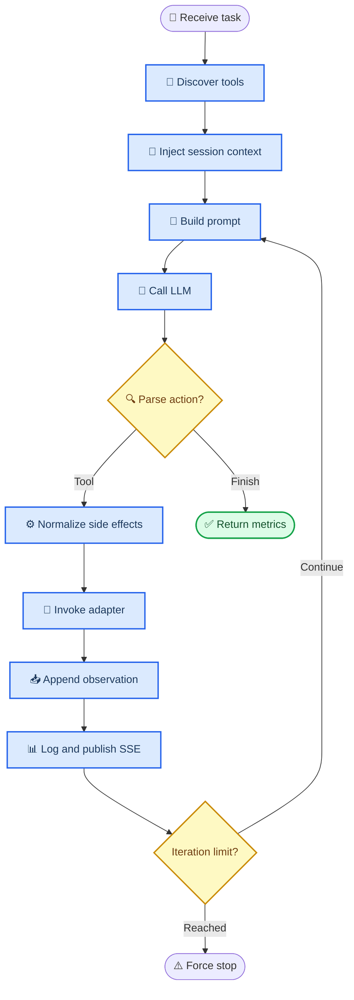
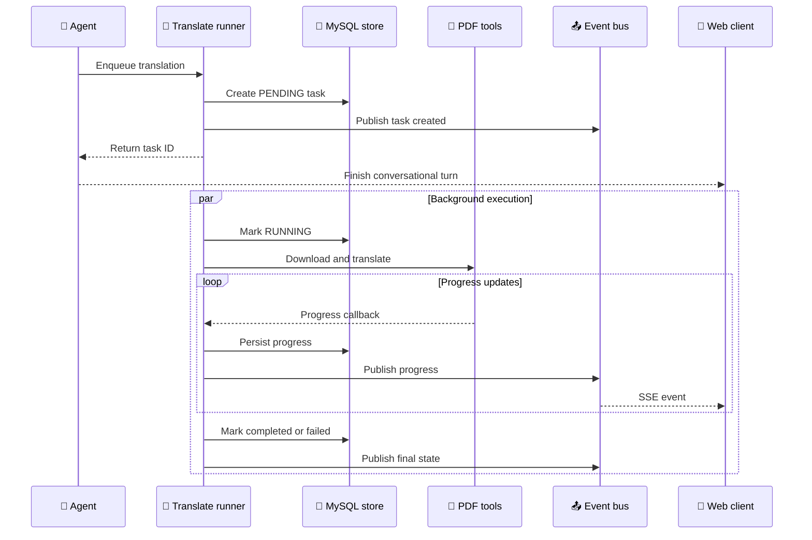

# AgenticArxiv 项目解析

_从 Agent 执行内核、工具适配、状态管理和评测体系理解项目设计_

---

## 📋 一句话定义

AgenticArxiv 是一个把“检索论文—选择论文—下载原文—异步翻译—查看资产”组织成可观测 Agent 工作流的全栈系统。其最有价值的设计，是以统一 `BaseAgent` 承载控制面，以三种可替换适配器承载工具调用数据面，从而把 Agent 行为与具体协议解耦。

## 🎯 设计目标

项目解决的并不是单个 arXiv API 调用，而是五类工程问题：

| 问题 | 设计响应 |
| --- | --- |
| 多步骤任务如何推进 | 最多 5 次的 ReAct 循环，每轮一个 Action |
| 三种工具调用方式如何公平比较 | 共用 LLM 客户端、执行循环、工具和业务副作用 |
| “第 1 篇”“刚才那篇”如何解析 | 持久化 session 论文列表和最近活动论文 |
| 长耗时翻译如何不阻塞对话 | 后台线程执行、任务表持久化、SSE 推送进度 |
| 如何定位慢和错在哪里 | 分步记录 LLM/工具耗时、Action、Observation 和 Token |

## 🏗️ Agent 内核

### 模板方法：稳定控制面

`BaseAgent.run()` 是核心。它把每个 Agent 都需要的逻辑收敛到同一个模板流程：

1. 为本次请求创建消息 ID，并记录用户消息
2. 发现工具并构造工具描述
3. 从 MySQL 读取会话论文，将上下文注入任务
4. 调用 LLM，累计延迟和 Token
5. 让子类解析 `Thought` 与 `Action`
6. 在统一副作用层校正参数并执行工具
7. 持久化步骤并通过 SSE 发布
8. 在 `FINISH`、错误或第 5 次迭代后终止
9. 返回历史、最终观察、耗时分解与 Token 用量

这是一种模板方法设计：变化被限制在四个抽象方法中，稳定的控制逻辑只保留一份。



### 适配器：变化数据面

三个实现共享业务语义，但把工具描述和调用通道变成了实验变量。

| 维度 | ReAct regex | MCP | Skill/CLI |
| --- | --- | --- | --- |
| 工具描述 | Registry 转文本 | MCP `list_tools` 后转文本 | 读取 `SKILL.md` |
| Action 格式 | JSON | JSON | CLI 命令 |
| 解析 | 正则 + JSON + 文本降级 | 正则 + JSON | 正则 + `shlex` |
| 执行 | 当前进程 | MCP Server 子进程 | Python CLI 子进程 |
| 隔离 | 无 | 协议与进程隔离 | 命令进程隔离 |
| 主要成本 | 文本格式脆弱性 | event loop 与 JSON-RPC 桥接 | 进程启动和文档维护 |

这里有一个容易误解的点：MCP 模式并没有改变推理策略，仍然使用相同的 ReAct Prompt 和文本解析；它改变的是工具发现与执行通道。因此当前 Benchmark 主要比较工具协议/表示方式，而不是三种完全不同的 Agent 推理算法。

### MCP 的同步—异步桥接

`BaseAgent.run()` 是同步循环，而 MCP SDK 使用异步 stdio 会话。`MCPAgent` 通过两层桥接避免阻塞 JSON-RPC：

- 在 event loop 中维护 MCP session
- 把同步 `BaseAgent.run()` 放入线程池
- 工具调用再通过 `asyncio.run_coroutine_threadsafe()` 投递回原 event loop

```mermaid
sequenceDiagram
    accTitle: MCP Sync Async Bridge
    accDescr: The MCP event loop owns the stdio session while the synchronous BaseAgent loop runs in a worker and schedules tool calls back to the owning loop.

    participant caller as 🌐 API thread
    participant loop as 🔄 MCP event loop
    participant worker as ⚙️ Agent worker
    participant server as 📦 MCP server
    participant registry as 🔧 ToolRegistry

    caller->>loop: Start MCP session
    loop->>server: Initialize and list tools
    server-->>loop: Tool schemas
    loop->>worker: Run BaseAgent
    worker->>loop: Schedule call_tool
    loop->>server: JSON RPC over stdio
    server->>registry: Execute registered function
    registry-->>server: Tool result
    server-->>loop: TextContent JSON
    loop-->>worker: Decoded observation
    worker-->>loop: Final Agent result
    loop-->>caller: Close session and return
```

### Skill/CLI 的安全边界

LLM 输出看起来是 Bash 命令，但执行路径进行了收窄：

1. 只识别 `search_papers`、`download_pdf`、`translate_pdf`、`cache_status`
2. 使用 `shlex.split()` 解析文本
3. 只提取 `--key=value` 参数并做基础类型推断
4. 映射回内部 Registry 工具名
5. 重新构造 `[python, tool_cli.py, subcommand, ...]` 参数数组
6. 使用 `subprocess.run()` 且不启用 `shell=True`

这比直接执行模型生成的 Shell 安全，但还不是完整沙箱：参数级文件访问、子进程权限、超时和输出大小仍应继续治理。

## ⚙️ 业务编排层

### 为什么副作用不放在各 Agent 里

`_execute_with_side_effects()` 是项目中最关键的统一层。它保证无论调用通道如何变化，下列规则都一致：

- 用服务端真实 session 覆盖模型生成的 `session_id`
- 在执行前验证工具是否存在
- 将翻译工具改写为异步 `enqueue`
- 把工具返回的 `paper_id` 写成最近活动论文
- 把搜索结果写入当前 session
- 将工具返回值压缩成下一轮可消费的 Observation

如果这些逻辑分别存在于三个 Agent 中，Benchmark 很容易比较到不同的业务实现，而不是不同的 Agent 通道。当前抽取方式避免了这一混杂变量。

### 异步翻译

翻译任务采用轻量的后台线程模型：`TranslateRunner.enqueue()` 先解析论文和 PDF 输入、创建持久化任务，再启动线程执行 `pdf2zh`。任务状态和进度既写入 MySQL，也发送给当前 session 的 SSE 订阅者。



## 💾 记忆与状态

项目把“记忆”拆成两层，而不是把所有历史不断塞回 Prompt：

| 层次 | 内容 | 用途 |
| --- | --- | --- |
| 当前运行历史 | 最近几轮 Thought/Action/Observation | 支持 ReAct 自我修正 |
| 持久化会话状态 | 论文列表、最近活动论文、资产和任务 | 支持跨请求指代与恢复 |

`_enrich_task_with_context()` 最多注入 10 篇论文标题，并提示模型可用 `ref` 序号复用已有结果。这种面向任务的压缩状态，比无上限回放完整聊天更可控，但尚未覆盖长期语义记忆、摘要压缩或多用户权限隔离。

### 数据模型

7 张表分别管理 `pdf_assets`、`translate_assets`、`sessions`、`session_papers`、`translate_tasks`、`chat_logs` 和 `agent_steps`。其中 `chat_logs` 保存消息级信息，`agent_steps` 保存 Agent 内部执行级信息，二者通过 `msg_id` 关联。

启动时的 `Base.metadata.create_all()` 适合本地演示和新库初始化，但无法升级既有 schema。若项目继续演进，数据库迁移应成为明确的基础设施层。

## 📊 可观测性与评测

### 分步遥测

每次运行返回并持久化以下信息：

- 端到端耗时
- 累计 LLM、工具与框架开销
- 每一步 LLM/工具延迟
- Prompt、Completion 与总 Token
- 迭代次数和终止类型
- 工具调用序列、解析失败和工具失败

这使“Agent 很慢”可以继续拆解成模型慢、工具慢、协议开销高或迭代次数多，而不是停留在总耗时层面。

### 当前实验结果

已提交的 `data/summary.json` 包含 210 条记录：7 个任务 × 3 种 Agent × 10 次重复。三种模式在该数据集上的任务完成率和工具调用准确率均为 100%。

| Agent | 样本 | 总耗时 | LLM 耗时 | 工具耗时 | 框架开销 | Token |
| --- | ---: | ---: | ---: | ---: | ---: | ---: |
| `regex` | 70 | 6,946.4 ms | 6,024.2 ms | 884.2 ms | 37.9 ms | 5,590.8 |
| `mcp` | 70 | 6,118.7 ms | 5,194.7 ms | 881.0 ms | 43.0 ms | 5,590.1 |
| `skill_cli` | 70 | 3,981.2 ms | 2,861.8 ms | 1,081.2 ms | 38.2 ms | 4,369.3 |

可以得到三个受限于当前实验范围的观察：

1. `skill_cli` 的工具耗时最高，符合额外子进程启动的预期
2. 它的 LLM 耗时和 Token 明显更低，最终抵消了工具侧成本
3. MCP 的平均框架开销只比 regex 高约 5.1 ms，当前实现中的主要耗时仍来自 LLM 和工具

### 结果边界

这些数字适合写进简历，但应保留实验限定：

- 任务集只有 7 种，且同一任务重复 10 次
- 三种模式共用同一 LLM，但网络延迟和模型缓存可能影响均值
- 工具准确率采用“预期工具按顺序出现”的子序列判定，不检查多余调用
- 完成率只判断最终 Action 是否为 `FINISH`，不等价于答案语义完全正确
- 解析失败统计依赖历史中的标记，无法覆盖所有静默误解析
- 当前报告给出均值，没有同时展示中位数、分位数或置信区间

因此，更严谨的下一步是增加对抗样例、参数正确率、语义评分、冷/热启动分组，以及 P50/P95 和置信区间。

## 🔍 设计亮点

### 1. 把协议差异限制在最小边界

三个 Agent 没有复制完整循环，只实现协议相关方法。新增第四种工具通道时，不需要重写会话、翻译和日志逻辑。

### 2. 把模型不可信输入在服务端校正

系统覆盖 `session_id`、验证工具白名单，并将翻译强制改为异步任务。模型负责决策，服务端负责业务不变量。

### 3. 把长任务从推理循环中移出

Agent 获得任务 ID 后即可 `FINISH`，翻译进度由事件系统负责，避免模型轮询和对话请求阻塞。

### 4. 让设计选择可以被实验验证

统一埋点和标准任务集把“哪个 Agent 更好”转换成可复现的数据问题，同时保留原始 CSV、JSON 和图表。

## ⚠️ 工程权衡

| 当前选择 | 收益 | 风险 | 可演进方向 |
| --- | --- | --- | --- |
| 正则解析 ReAct | 实现直接、便于观察 | 格式脆弱，误解析可能被当作结束 | JSON Schema 或原生 tool calling |
| 单进程 EventBus | 简单、低延迟 | 多实例间事件不共享 | Redis Streams 或消息队列 |
| 后台线程翻译 | MVP 成本低 | 重启丢执行线程，吞吐不可控 | Celery、RQ 或独立 Worker |
| `create_all()` 建表 | 首次启动零迁移 | 无法升级已有 schema | Alembic |
| 全局 ToolRegistry | 插件化注册简单 | 导入顺序隐式、缺少版本治理 | 显式插件清单与契约测试 |
| 公开 Thought 日志 | 调试价值高 | 生产环境存在隐私和泄露风险 | 保存结构化决策摘要而非原始思维文本 |

## 📚 面试讲解主线

推荐按下面的顺序介绍，而不是从“这是一个论文搜索网站”开始：

1. **问题**：希望在同一业务上比较多种 Agent 工具调用架构
2. **抽象**：以 `BaseAgent` 固化控制面，以适配器隔离协议差异
3. **一致性**：用统一副作用层维护 session、异步任务和工具结果
4. **实时性**：用后台任务 + SSE 解耦长耗时翻译
5. **可观测性**：记录每步行为、耗时与 Token，构建 210 次 Benchmark
6. **结果**：三种模式在标准任务上均正确完成，Skill/CLI 在该实验中显著降低总耗时和 Token
7. **反思**：说明当前指标定义和单机架构的边界，并给出下一步演进方案

这条主线能同时展示 Agent 设计、后端架构、实验方法和工程判断。
